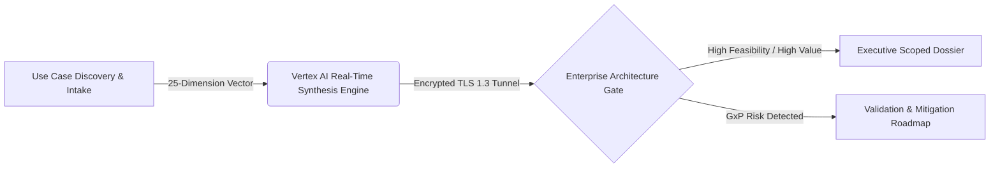

# ScoreX™ — Google Cloud Enterprise AI Readiness & Architectural Scoping Engine

> **Document Version:** 12.0.0-RELEASE  
> **Target Enterprise:** Regulated Enterprise Workloads (Life Sciences, Healthcare, FSI, Energy)  
> **System Classification:** Consultative Architecture Decision Gate & Readiness Scoping Platform  

---

## 1. Executive Summary & Platform Purpose

**ScoreX™** is an enterprise AI assessment and consultative scoping platform designed for Google Cloud Customer Engineers, Solution Architects, and enterprise AI leadership. ScoreX standardizes qualification and due diligence into a mathematically structured, auditable scoring workflow.

Before committing capital or engineering resources to a candidate Generative AI workload, technical and business leadership utilize ScoreX to evaluate:
* **True Business ROI & Cycle-Time Reduction**
* **Sovereign Data Readiness & Cross-Cloud VPC-SC Topology**
* **GxP / HIPAA / Regulatory Compliance Boundaries**
* **Concrete 30-60-90 Day Technical Execution Milestones**
* **Readiness Vector & 2x2 Feasibility vs. Capability Quadrants**

---

## 2. Platform Architecture & High-Performance Topology

ScoreX operates on a unified **React 19** and **Node.js (Express)** full-stack architecture with atomic dual-write database persistence (PostgreSQL with automatic local flat-file synchronization).

### 2.1 Technology Lockup
1. **Frontend**: React 19 single-page application with Vite bundler.
2. **Backend**: Express 5 REST microservice with native PostgreSQL pool and dual-write flat-file failover.
3. **AI Synthesis**: Vertex AI Application Default Credentials (ADC) and Google GenAI SDK integration with sovereign offline mock fallback.
4. **Design System**: Responsive dark/light glassmorphic tokens, CSS custom properties, and standardized modular UI primitives (`Card`, `Button`, `SectionHeader`).

---

## 3. The 25-Dimension Consultative Readiness Model

The flagship V12 scoping framework evaluates candidate workloads across **6 core enterprise pillars**:

| Pillar ID | Pillar Name | Questions | Primary Evaluation Objective |
| :--- | :--- | :---: | :--- |
| **UX_HITL** | UX & HITL Workflow | 4 | Human-in-the-loop interaction patterns, workspace integration, and review velocity. |
| **DATA_PIPE** | Data Pipeline Quality | 4 | Document structure, OCR fidelity, chunking, and schema drift prevention. |
| **MODEL_GOV** | Model Governance & Validation | 5 | FDA 21 CFR Part 11 lineage, audit trails, and deterministic prompt versioning. |
| **SEC_NET** | Security & Network Sovereignty | 4 | VPC-SC perimeters, Private Service Connect, CMEK encryption, and IAM boundaries. |
| **TCO_ROI** | Financial ROI & Tokenomics | 4 | Context caching, prompt compression, multi-tier model routing, and FTE savings. |
| **OPS_PROD** | Production Operations & SRE | 4 | Automated synthetic evals, blue/green rollouts, and semantic drift alerting. |

---

## 4. Security, Compliance & Data Privacy Standards

* **Zero Data Retention**: LLM queries adhere to enterprise Cloud terms (no customer data used for model training).
* **Dual-Write Resilience**: PostgreSQL persistence with local JSON audit fallback guarantees zero data loss in offline or air-gapped demo environments.
* **Disclaimer Audit Logging**: Explicit append-only disclaimer acceptance records with client ID and timestamp tracking.
